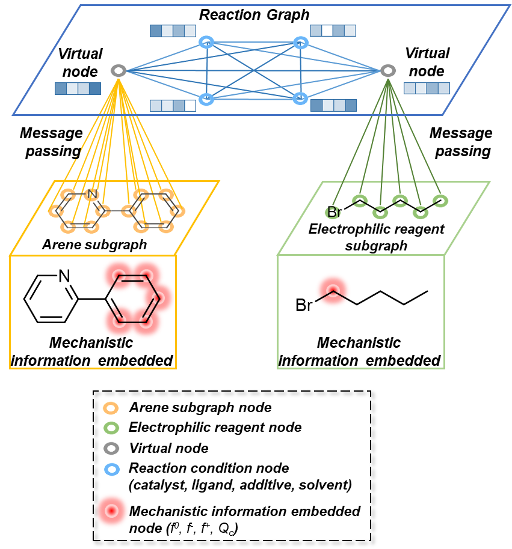
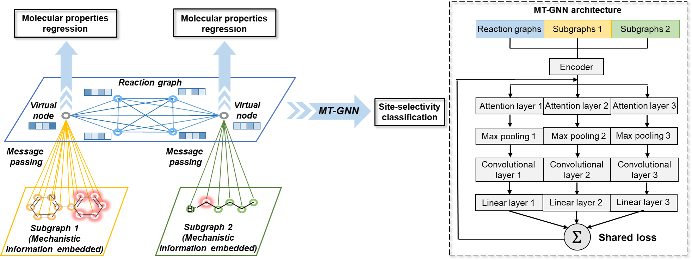

# MT-GNN
This is a repository for the paper entitled "Integrating Multi-Task Graph Neural Network and DFT Calculations for Site-Selectivity Prediction of Arenes and Mechanistic Knowledge Generation"
# Introduction
A multi-task learning graph neural network was developed for the prediction of the challenging site-selectivity of ruthenium-catalyzed C-H functionalization of arenes. The ruthenium-catalyzed C-H functionalization exhibits constantly changing of the site-selectivity due to the subtle changes of the reaction components, including arene, electrophile, catalyst, ligand, solvent and additive. The dataset was collected manually including 256 individual reactions along with 95 arenes and 67 electrophiles. Two key design elements facilitate site-selectivity prediction: the mechanistically informed reaction graph and the multi-task architecture. Two additional test set (experimental and out-of-sample test) were prepared to validate the extrapolative ability of the MT-GNN model.
## Mechanistic-informed reaction graph
For a better reaction representation, the mechanistic information is embedded to the reactive atoms of the two substrates. Through message passing, the two substrate graphs are condensed to two virtual nodes. Together with other four reaction component nodes (catalyst, solvent, ligand and additive), a reaction graph is completed.

    

Multi-task architecture
The site-selectivity classification task is optimized alongside with two molecular property regression tasks of reaction substrates (arene and electrophile). These two regression tasks which is related to the site-selectivity aim to assisted the classification task by knowledge acquisition during the simultaneous learning.

# Dependence
python 3.11.5  
pandas 2.1.4  
numpy 1.24.3  
rdkit 2022.09.5  
torch 1.13.1  
sklearn 1.3.0  
dgl 1.1.3  
scipy 1.11.4  
seaborn 0.13.2  
matplotlib 3.8.0  
# Installation of dependence
We recommend using Anaconda for preparing the dependence as some packages are built-in Anaconda base environment, which are not mentioned in the dependence section. 
# Demo
The Jupyter notebook training_MultiTaskGNN.ipynb presents an example of training the MT-GNN model using the ruthenium-catalyzed C–H functionalization dataset. Additionally, other competent models are demonstrated in the accompanying Jupyter notebooks.
